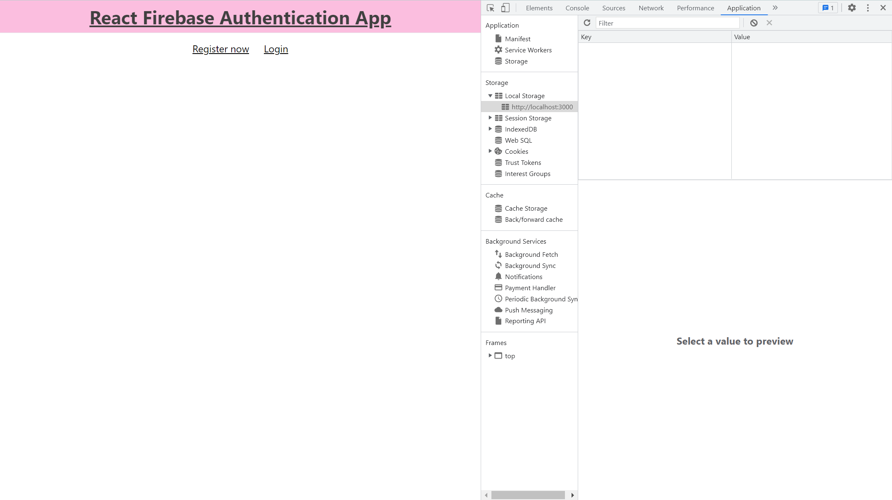
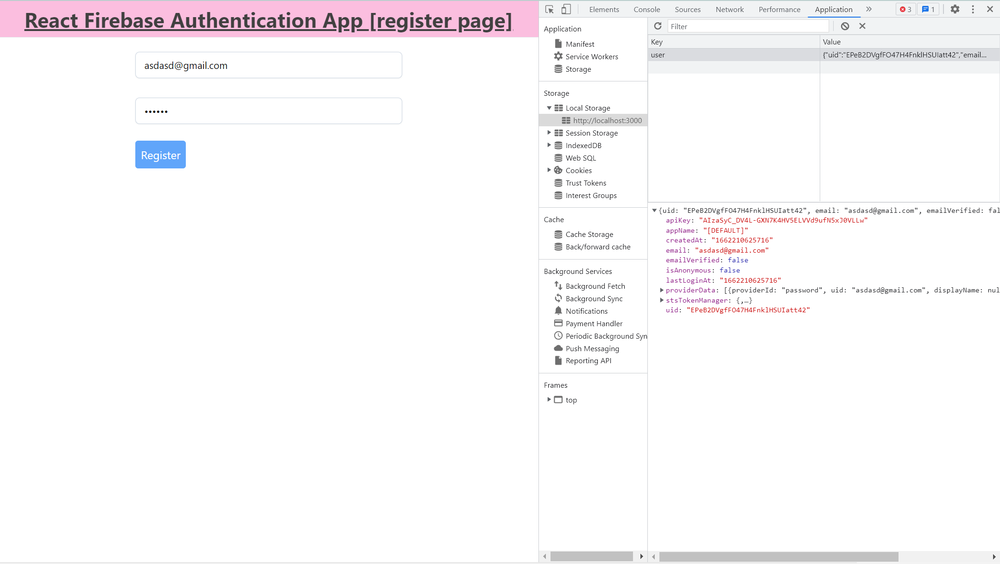
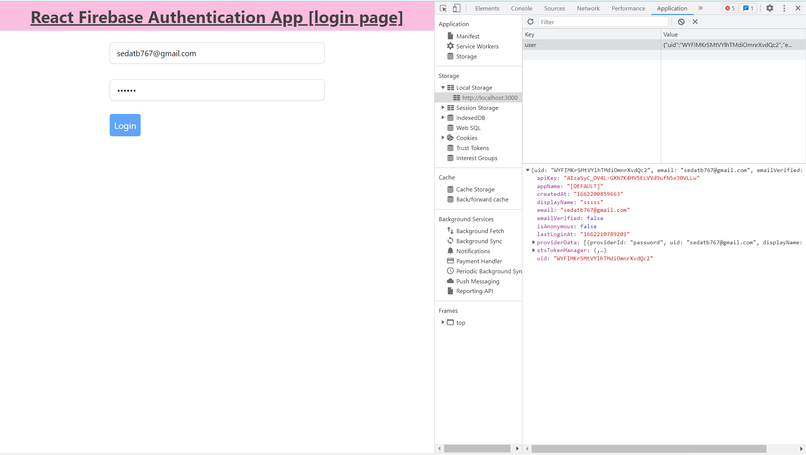
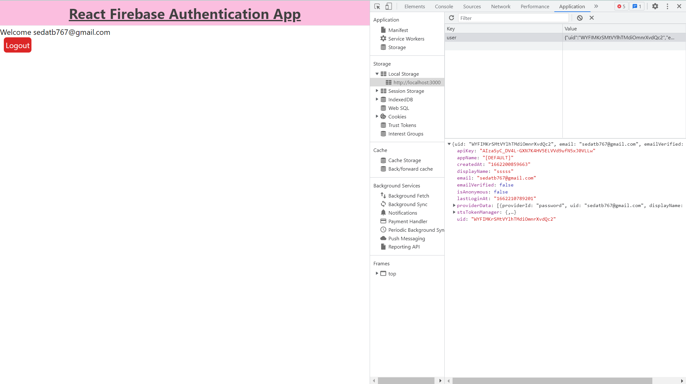
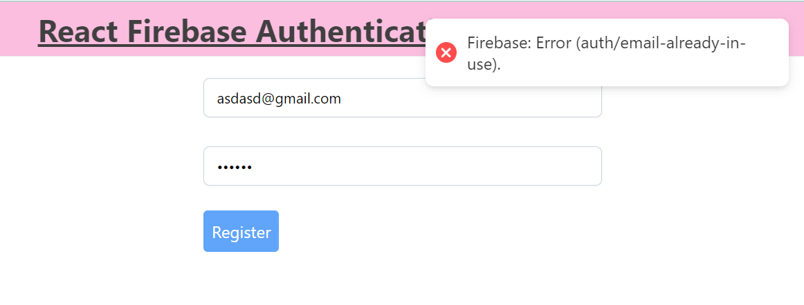
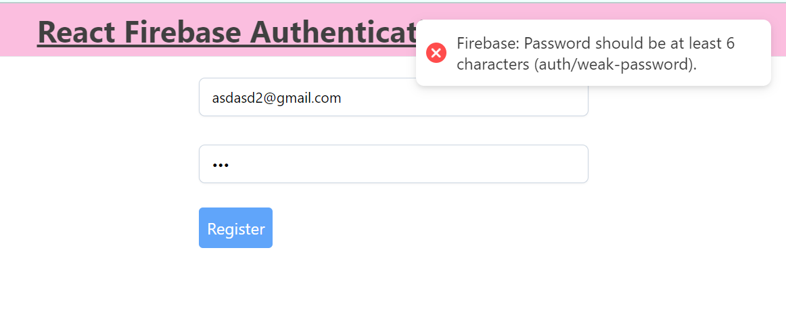
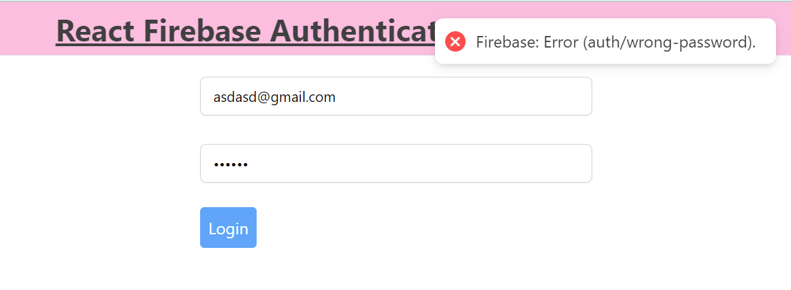
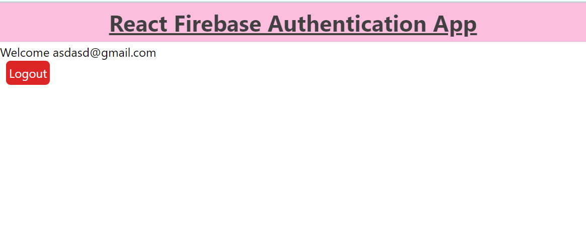

# React Firebase Authentication Project 
In this project  just try to do firebase auth in react app

## Using Tech
<ul>
    <li>Firebase</li> 
    <li>ReactRedux</li>
    <li>React Hot Toast</li>
    <li>Tailwind CSS</li>
    <li>JS local Storage</li>
</ul>

## ScreenShots

